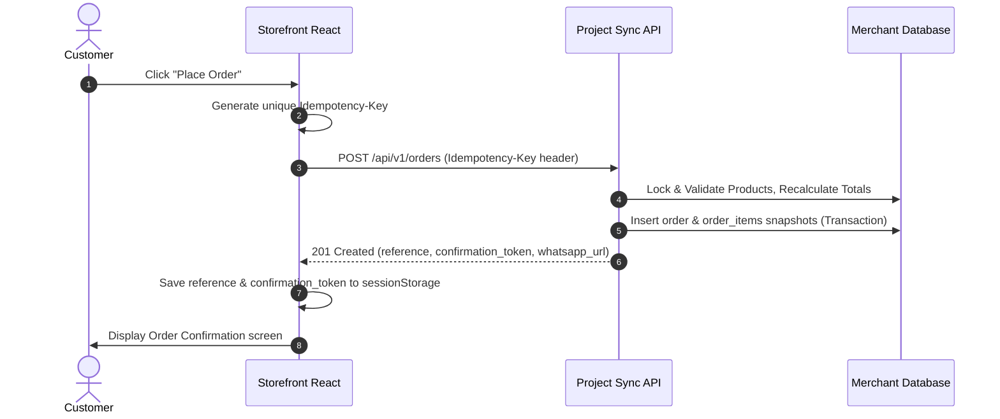
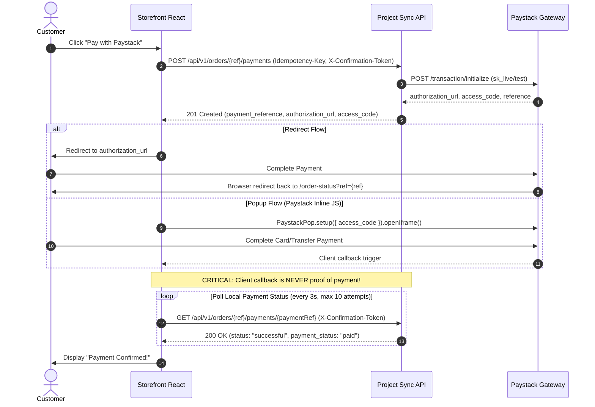

# Project Sync Frontend Integration Handbook

This guide defines how frontend applications (Storefront React SPA and Merchant Admin React Dashboard) communicate with the Project Sync backend API.

---

## 1. Overview & Base URLs

- **API Base Route**: `/api/v1`
- **Interactive Swagger Documentation**: `/api/docs`
- **OpenAPI Definition**: `/api/openapi.yaml` | `/api/openapi.json`
- **Headers**:
  - `Accept: application/json`
  - `Content-Type: application/json` (for POST/PUT/PATCH with body)
  - `Authorization: Bearer <access_token>` (for `/api/v1/admin/*` endpoints)

---

## 2. API Response Contract

Every response from Project Sync strictly follows standard JSON response envelopes.

### Success Response Envelope
```json
{
  "success": true,
  "data": {
    "product": { ... }
  },
  "meta": {
    "request_id": "req_66c1f8a2b3c4d",
    "idempotent_replay": false
  }
}
```

### Paginated List Envelope
```json
{
  "success": true,
  "data": [ ... ],
  "meta": {
    "page": 1,
    "per_page": 20,
    "total": 45,
    "total_pages": 3,
    "request_id": "req_66c1f8a2b3c4d"
  }
}
```

### Error Response Envelope
```json
{
  "success": false,
  "error": {
    "code": "VALIDATION_FAILED",
    "message": "The request payload failed field validation.",
    "fields": {
      "customer_name": ["Customer name is required."],
      "phone_number": ["Please provide a valid phone number."]
    }
  },
  "meta": {
    "request_id": "req_66c1f8a2b3c4d"
  }
}
```

---

## 3. Money Representation & Pricing Rules

- **Minor Units Only**: All monetary amounts (`price_kobo`, `subtotal_kobo`, `delivery_fee_kobo`, `total_kobo`, `amount_kobo`) are represented as non-negative integers in Nigerian Kobo:
  $$\text{15000 Kobo} = \text{NGN 150.00}$$
- **Frontend Formatting**: Convert to Naira for display only:
  ```javascript
  export const formatNaira = (kobo) => `₦${(kobo / 100).toLocaleString('en-NG', { minimumFractionDigits: 2 })}`;
  ```
- **Authoritative Calculations**: The frontend must **never** send client-calculated order totals to the server. The backend recalculates all item prices and delivery fees authoritative from database records at checkout time.

---

## 4. Product Availability Rules

Every product returned by the backend contains two availability flags:

| Flag | Meaning & Frontend Handling |
|---|---|
| `is_active: false` | Product is disabled/archived. It is automatically excluded from public listings (`GET /api/v1/products`) and returns `404 PRODUCT_NOT_FOUND` on detail lookup (`GET /api/v1/products/{slug}`). |
| `is_active: true, is_available: false` | Product is active in the catalogue but currently out of stock or ordering is paused. **Frontend Action**: Display product badge *"Out of Stock"* or *"Unavailable"* and disable the *"Add to Cart"* button. |
| `is_active: true, is_available: true` | Product is active and available for purchase. |

> [!NOTE]
> If a customer has an item in their local cart and the merchant marks it `is_available: false` before checkout, the server will reject the order with `422 PRODUCT_UNAVAILABLE`. The frontend should prompt the customer to remove the unavailable item.

---

## 5. Storefront Guest Checkout Workflow



### Guest Checkout Request Example:
```http
POST /api/v1/orders HTTP/1.1
Host: store.vintageboutique.ng
Idempotency-Key: checkout-attempt-20260818-abc12345
Content-Type: application/json

{
  "customer_name": "Amaka Okafor",
  "phone_number": "+2348012345678",
  "customer_email": "amaka@example.com",
  "fulfilment_method": "delivery",
  "delivery_address": "12 Marina Road, Lagos Island",
  "state": "Lagos",
  "payment_method": "paystack",
  "notes": "Call upon arrival",
  "items": [
    {
      "product_id": "9b1deb4d-3b7d-4bad-9bdd-2b0d7b3dcb6d",
      "quantity": 2
    }
  ]
}
```

---

## 6. Paystack Payment Flow (Zero Trust)



---

## 7. Merchant Admin Authentication & Session Management

### 7.1 Admin Login
```http
POST /api/v1/admin/login HTTP/1.1
Host: store.vintageboutique.ng
Origin: https://store.vintageboutique.ng
Content-Type: application/json

{
  "email": "admin@vintageboutique.ng",
  "password": "SecurePassword123!"
}
```
**Response**:
- `data.access_token`: Short-lived JWT (15-minute lifetime). **Store strictly in React memory** (e.g. React context or Zustand store). **NEVER** save to `localStorage` or `sessionStorage`.
- `Set-Cookie: project_sync_refresh=...; HttpOnly; Secure; SameSite=Strict`: Rotating refresh token cookie managed automatically by the browser.

### 7.2 Automatic Token Refresh
Before the 15-minute access token expires (or upon receiving `401 UNAUTHENTICATED`), call:
```http
POST /api/v1/admin/refresh HTTP/1.1
Host: store.vintageboutique.ng
Origin: https://store.vintageboutique.ng
```
(Include `credentials: 'include'` in `fetch()` or `withCredentials: true` in `axios` so the browser sends the `project_sync_refresh` cookie).

### 7.3 Admin Logout
```http
POST /api/v1/admin/logout HTTP/1.1
Host: store.vintageboutique.ng
Authorization: Bearer <access_token>
```
Revokes the refresh token family and denylists the access token until its expiration.

---

## 8. Merchant Order Fulfilment Lifecycle

Fulfilment statuses follow an explicit, irreversible state machine:

```text
       ┌───────────────┐
       │      new      │
       └───────┬───────┘
               │
       ┌───────▼───────┐
       │   confirmed   │
       └───────┬───────┘
               │
       ┌───────▼───────┐
       │  processing   │
       └───────┬───────┘
               │
       ┌───────▼───────┐
       │     ready     │
       └───────┬───────┘
               │
       ┌───────▼───────┐
       │   completed   │ (Terminal)
       └───────────────┘

* Note: Any active state (new, confirmed, processing, ready) can transition to 'cancelled' (Terminal).
```

### Updating Order Status:
```http
PATCH /api/v1/admin/orders/12/status HTTP/1.1
Authorization: Bearer <access_token>
Content-Type: application/json

{
  "status": "confirmed"
}
```

---

## 9. Error Code Reference

| Error Code | HTTP Status | Description & Recommended UI Action |
|---|---|---|
| `VALIDATION_FAILED` | 422 | Form field validation failed. Highlight inputs using `error.fields`. |
| `UNAUTHENTICATED` | 401 | Missing or expired JWT. Trigger `/admin/refresh` or redirect to `/login`. |
| `PRODUCT_UNAVAILABLE` | 422 | An item in cart is no longer available. Prompt user to remove it. |
| `PRODUCT_NOT_FOUND` | 404 | Product does not exist or is inactive. Show 404 Not Found page. |
| `ORDER_NOT_FOUND` | 404 | Order reference does not exist. |
| `CONFIRMATION_TOKEN_INVALID` | 401 | Secret token does not match order. |
| `INVALID_STATUS_TRANSITION` | 409 | Attempted illegal order transition. Refresh order detail page. |
| `PAYMENT_ALREADY_COMPLETED` | 409 | Order is already paid. Redirect to confirmation. |
| `RATE_LIMITED` | 429 | Too many requests. Display retry countdown. |
| `INTERNAL_ERROR` | 500 | Unexpected server error. Display support contact message with `meta.request_id`. |
